# EX · Externalidades socioambientais

## Pergunta-âncora (o que faz um avaliador dar 5)
> Externalidades além do produto: formação UFCG (bolsistas, artigo), impacto
> regional (Campina Grande/PB), perfil escasso de IA fundamentada.

## Decisões de enquadramento (grill 2026-06-25 · Track D)
- **Externalidades em DOIS ANDARES** (desarma o ataque de circularidade do
  `99-red-team/gaps.md`, EX): um **piso garantido** que não depende de IES + um
  **andar de upside** com IES. `*` = condicionado a vencer o edital.
- A **circularidade UFCG está dissolvida** (`01-solucao/PDT.md`): as bolsas CNPq
  são concedidas ao projeto aprovado e recrutadas pelo coordenador — não exigem
  convênio institucional. Logo, bolsas/formação de RH ficam no **piso garantido**;
  só o que é UFCG-específico (lab, orientação acadêmica, ancoragem em Campina
  Grande) é **upside**.

---

## 1. Externalidades (dois andares)

### Piso garantido (independe de IES; condicionado só a vencer, como todo recurso)
- **Empregos diretos qualificados:** dev PJ, operação comercial por gatilho.
- **Capacitação dos técnicos da empresa-piloto** (acordo assinado — externalidade
  real, medida no piloto).
- **Digitalização/profissionalização** de autônomos e PMEs do setor elétrico
  (inclusão produtiva, formalização — `[hipótese a validar no piloto]`).
- **Bolsas CNPq / formação de RH** (DTI/EV/SET)* — recrutadas de qualquer IES.
- **Contribuição replicável a outras normas** (NR-10, NBR 14039) como ativo do
  projeto.
- **Elevação do piso técnico** da categoria de eletricistas.

### Andar de upside (UFCG-específico)*
- Laboratório, orientação acadêmica do mestrando, talento especializado.
- **Ancoragem regional em Campina Grande/PB** — descentralização da inovação no NE.
- Produção acadêmica conjunta (artigo, base autoral NBR como conhecimento aberto).

---

## 2. Impact Gap Canvas (D2)

### O Desafio
- **Problema:** manutenção elétrica insegura (840 mortes/ano por acidentes
  elétricos — ABRACOPEL) e não-profissionalizada (73% das empresas sem sistema
  de gestão — ABDI/SEBRAE), sobretudo entre autônomos e PMEs de nicho (geradores).
- **Causas-raiz:** intervenção sem seguir norma; conhecimento tribal/dependente
  de sênior; júnior desassistido; ausência de rastreabilidade; ferramentas de
  gestão caras e genéricas.
- **Quem sofre:** técnicos, donos de PME, clientes finais, comunidade exposta.

### Paisagem de Soluções (o "concorrente" do impacto)

| Solução existente | O que funciona | O que NÃO funciona (deixa lacuna) |
|---|---|---|
| **CMMS generalista** | gestão de OS, ativos | caro; genérico (não cobre o nicho); zero conhecimento de norma elétrica BR; sem IA fundamentada |
| **IA genérica** (ChatGPT etc.) | resposta rápida, acessível | alucina; não cita norma/fonte; sem trava de segurança (LOTO); risco em contexto crítico |
| **Consultoria / cursos NBR** | conhecimento confiável | caro; fora do fluxo de trabalho; não escala; não está na hora da intervenção |
| **Status quo** (papel, WhatsApp, sênior) | barato, familiar | sem rastreabilidade; conhecimento tribal; júnior desassistido; não-conforme |

### A Lacuna (onde o Lumio age)
> Um CMMS **acessível**, **especializado por nicho**, com Copiloto de IA
> **fundamentado** (cita NBR/manual + nível de confiança), com **travas de
> segurança** (LOTO obrigatório) e **embutido no fluxo da OS** — voltado ao
> pequeno operador elétrico brasileiro.
>
> O diferencial é a **interseção**: nenhum concorrente cobre os 5 atributos ao
> mesmo tempo (fundamentado + seguro + no fluxo + acessível + especializado).

---

## 3. Theory of Change (D3)

**Princípio de medição (desarma "100% dos números são hipóteses"):** os
indicadores de resultado são **proxies controláveis** medidos no piloto; o piloto
**estabelece o baseline e a meta é melhoria direcional**. Metas duras só onde o
projeto controla o número (adoção, verbetes, bolsistas). A redução de acidentes é
**impacto populacional de longo prazo, contextual — não atribuível 1:1** ao uso.

### Indicadores

| Indicador | Tipo | Meta |
|---|---|---|
| % de OS com LOTO registrado / citação de norma | proxy de segurança | baseline no piloto → melhoria direcional (↑) |
| Tempo médio de diagnóstico/resolução | proxy de agilidade | baseline no piloto → melhoria direcional (↓) |
| Nº de empresas/técnicos ativos; nº de OS digitalizadas | adoção/inclusão | meta dura (SOM: 10 → 100–150 em 36 m) |
| Nº de verbetes NBR na base; manuais indexados | produto/moat | meta dura |
| Nº de bolsistas formados* | formação/RH | meta dura |
| Tendência de acidentes no setor | impacto populacional | contextual/aspiracional, não atribuível 1:1 |

### Cadeia (mermaid)

```mermaid
flowchart LR
    subgraph INS["Insumos"]
        I1["Subvenção + bolsas*"]
        I2["Equipe + advisor"]
        I3["Base autoral NBR"]
        I4["GerenciaLume MVP"]
        I5["Empresa-piloto"]
        I6["IA commodity"]
    end

    subgraph ATV["Atividades"]
        A1["Desenvolver Copiloto RAG*"]
        A2["Curar base NBR*"]
        A3["Indexar manuais*"]
        A4["Desenvolver CMMS"]
        A5["Operação comercial"]
    end

    subgraph PRD["Produtos"]
        P1["Copiloto fundamentado no fluxo da OS"]
        P2["CMMS especializado por nicho"]
        P3["Base com N verbetes + manuais"]
        P4["X empresas/técnicos ativos"]
    end

    subgraph RES["Resultados (curto-médio)"]
        R1["↑ % OS com LOTO / citação de norma"]
        R2["↓ tempo de diagnóstico"]
        R3["↑ rastreabilidade / formalização"]
        R4["Júnior capacitado"]
    end

    subgraph IMP["Impacto (longo prazo)"]
        M1["↓ acidentes elétricos (contexto: 840/ano)"]
        M2["Profissionalização do setor"]
        M3["Formação de RH especializado*"]
        M4["Inovação regional no NE*"]
    end

    INS --> ATV --> PRD --> RES --> IMP
```

---

## Insumo bruto (síntese para a submissão)
As externalidades do Lumio sobrevivem ao pior cenário (IES não formalizada):
empregos diretos, capacitação dos técnicos do piloto, digitalização/formalização
do setor, bolsas CNPq e contribuição replicável a outras normas formam um **piso
garantido**; lab, orientação acadêmica e ancoragem regional em Campina Grande/PB
são **upside** com a IES. O Impact Gap Canvas mostra que nenhum concorrente ocupa
a interseção *fundamentado + seguro + no fluxo + acessível + especializado*. A
Theory of Change liga insumos a impacto por **proxies mensuráveis no piloto**
(LOTO/citação de norma, tempo de diagnóstico, adoção), tratando a redução de
acidentes como impacto populacional de longo prazo — compromisso de **medição**,
não de percentual cravado.

## Fontes
(registradas em `00-fontes/evidencias.md`: 840 mortes ABRACOPEL; 73% sem gestão
ABDI/SEBRAE; bolsas §6.1–6.3. Circularidade dissolvida: `01-solucao/PDT.md`.)
